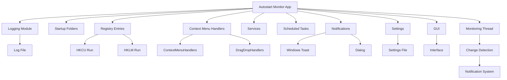

# README.md - Autostart Monitor  
### Light Mode (English)  


### Dark Mode (German)  


A Windows monitoring tool that detects unauthorized changes to autostart locations. Continuously checks startup folders, registry entries, services and scheduled tasks. Alerts via notifications/sounds and provides direct access to relevant system tools for analysis.

## Table of Contents
- [Introduction](#introduction)
- [Features](#features)
- [Requirements](#requirements)
- [Installation](#installation)
- [Usage](#usage)
- [Configuration](#configuration)
- [Translations](#translations)
- [Developer Notes](#developer-notes)
- [License](#license)
- [Contributors](#contributors)

## Introduction
Autostart Monitor is a security-oriented tool that monitors 12+ Windows autostart locations for unauthorized changes:
- Startup folders (User/All Users)
- Registry entries (HKCU/HKLM Run keys)
- Context menu handlers (Files/Folders/Background)
- System services (Startup type changes)
- Scheduled tasks

Key capabilities:
- Real-time monitoring with configurable interval (10-300s)
- Visual/Sound alerts with actionable dialogs
- Dark/Light mode with smooth animations
- German/English language support
- Persistent configuration

## Features
### Core Monitoring
- **Startup Folders**:  
  Tracks additions/removals in `%AppData%\Microsoft\Windows\Start Menu\Startup` and system-wide folder.

- **Registry Monitoring**:  
  - HKCU: `Software\Microsoft\Windows\CurrentVersion\Run`  
  - HKLM: `SOFTWARE\Microsoft\Windows\CurrentVersion\Run`  
  - Context Menu Handlers (Files/Folders/Background)

- **Services**:  
  Detects changes to service startup types via registry.

- **Scheduled Tasks**:  
  Monitors task additions/removals (basic implementation).

### Alert System
- **Multi-Channel Notifications**:  
  Choose between Windows Toasts, modal dialogs or both.

- **System Integration**:  
  - Alert sound via `winsound`  
  - Window flashing for background alerts  
  - Direct links to Regedit/Task Scheduler/Services  

- **Actionable Dialogs**:  
  One-click access to:  
  - Registry Editor  
  - Task Scheduler  
  - Services Console  
  - Autoruns.exe (auto-downloads if missing)

### UI Features
- **Dynamic Theme System**:  
  Smooth color transitions between dark/light modes.

- **Language Support**:  
  Switch between German/English on-the-fly.

- **Auto-Hide**:  
  Option to minimize to tray after 20s startup.

- **Persistent Settings**:  
  Saves configuration to `settings.json`.

## Requirements
- **OS**: Windows 10/11 (64-bit)
- **Python**: 3.9+ (tested with 3.11)
- **Dependencies**:
  ```bash
  pip install pyqt6 win10toast pywin32 ctypes
  ```

## Installation
1. Clone repository:
   ```bash
   git clone https://github.com/Junko666/autostart-monitor.git
   cd autostart-monitor
   ```
2. Create virtual environment:
   ```bash
   python -m venv venv
   venv\Scripts\activate
   ```
3. Install requirements:
   ```bash
   pip install -r requirements.txt
   ```
4. Start application:
   ```bash
   python main.py
   ```

## Usage
### Interface Overview
1. **Monitoring Methods**: Check which autostart locations to monitor
2. **Notification Channels**: Select alert types (Toasts/Dialogs)
3. **Settings**:  
   - Language: DE/EN  
   - Theme: Dark/Light  
   - Scan Interval: 10-300 seconds  
   - Auto-Hide: Minimize after launch

### Basic Workflow
1. Select monitoring methods (default: all enabled)
2. Choose notification preferences
3. Click "Start Monitoring"
4. On changes:  
   - Sound alert plays  
   - Window flashes (if minimized)  
   - Toast/Dialog shows details  
   - Buttons open relevant admin tools

### Context Actions
When a change dialog appears:
- **Registry Changes**: Opens Regedit at relevant path
- **Service Changes**: Launches Services Console
- **Tasks Changes**: Opens Task Scheduler
- **Autoruns**: Downloads/Runs Sysinternals Autoruns

## Configuration
Settings persist in `settings.json`:
```json
{
  "selected_methods": {
    "startup_folders": true,
    "registry": true,
    "registry_hklm_run": true,
    "context_handlers_star": true,
    "...": "..."
  },
  "notification_methods": {
    "windows_toast": true,
    "dialog": true
  },
  "auto_start": false,
  "language": "de",
  "dark_mode": false,
  "scan_interval": 60
}
```

### Key Settings
| Setting Group         | Options                          | Default  |
|-----------------------|----------------------------------|----------|
| Monitoring Methods    | 12 toggleable checkboxes         | All ON   |
| Notifications         | Toast/Dialog                     | Both ON  |
| Interface             | Language (DE/EN), Dark Mode      | DE, Light|
| Behavior              | Scan Interval (10-300s), Auto-Hide| 60s, OFF |

## Translations
### Supported Languages
- German (de) - Default
- English (en)

### Add New Language
1. Extend `update_language()` method in `AutostartMonitorWindow` class
2. Add translations for all UI elements
3. Create JSON file for system messages
4. Update language combo box

## Developer Notes
### Architecture Highlights


### Key Components
| File               | Responsibility                  |
|--------------------|---------------------------------|
| `main.py`          | Application entry point         |
| `AutostartMonitorWindow` | Main UI/PyQt6 logic      |
| `DEFAULT_SETTINGS` | Configuration defaults          |
| `compare_*` funcs  | Change detection algorithms     |

### Extension Ideas
1. **Tray Icon**:  
   Minimize to tray with monitoring status indicator.

2. **History Logging**:  
   Save change history to CSV/SQLite.

3. **Network Alerts**:  
   Send notifications via Email/Telegram API.

4. **Whitelisting**:  
   Allow users to exclude known-safe entries.

## License
MIT License - See [LICENSE](LICENSE) file.

## Contributors
1. [Junko](https://github.com/Junko666) - Development Director
2. OpenAI GPT-4 - Code Development
3. DeepSeek-R1-Lite-Preview - Documentation

---

**Disclaimer**: This tool interacts with critical system components. Use at your own risk. Always create system restore points before making changes.
